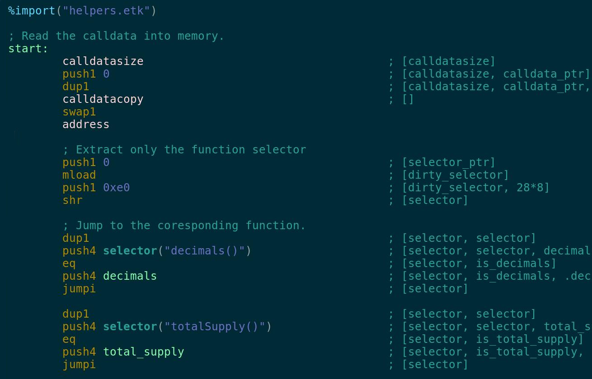

# vim-etk

Syntax highlighting for [`etk`](https://github.com/quit/etk) assembly format.

### Installation

`vim-etk` follows the standard runtime path structure. Below are some helper
lines for popular package managers:

* Vim 8 packages
	* `git clone https://github.com/quilt/vim-etk.git ~/.vim/pack/plugins/start/vim-etk`
* Pathogen
	* `git clone https://github.com/quilt/vim-etk.git ~/.vim/bundle/vim-etk`
* vim-plug
	* `Plug 'quilt/vim-etk', { 'branch': 'main' }`

---

